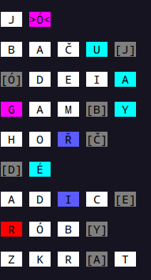
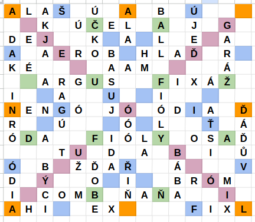

## Command-line parsing

```sh
ScrabblePuzzleGenerator test # no results
ScrabblePuzzleGenerator something
ScrabblePuzzleGenerator -s something # single result
ScrabblePuzzleGenerator something -s # order doesn't matter
ScrabblePuzzleGenerator -cgs something # combined flags: single result with grid and colors
ScrabblePuzzleGenerator -c -s -g something # same as above, but verbose
ScrabblePuzzleGenerator -csgd blex.txt something # custom dictionary
ScrabblePuzzleGenerator something -s -d blex.txt -v letter_values.txt # custom dictionary and letter values
ScrabblePuzzleGenerator -sn26 0,1,2 # numeric mode
ScrabblePuzzleGenerator -s -n 26 0,1,2 # numeric mode, single result
ScrabblePuzzleGenerator -n 0,1,2 # numeric 0 without modulo, this will have no results
ScrabblePuzzleGenerator UppercaseIsIgnored -s
```

### Neplatné argumenty, skončí s kódem 1 a vypíše nápovědu

```raw
ScrabblePuzzleGenerator
ScrabblePuzzleGenerator -x
ScrabblePuzzleGenerator word another
```

### Vypíše nápovědu s kódem 0

```raw
ScrabblePuzzleGenerator -h
ScrabblePuzzleGenerator -h test
ScrabblePuzzleGenerator test -h
```

### Jiné chybové hlášky

```raw
ScrabblePuzzleGenerator -d nonexistent_file test
ScrabblePuzzleGenerator -v nonexistent_file test
```

```raw
echo "a nonnumeric" > wrong_format1.txt
ScrabblePuzzleGenerator -v wrong_format1.txt test

echo "long 1" > wrong_format2.txt
ScrabblePuzzleGenerator -v wrong_format2.txt test
```

```raw
ScrabblePuzzleGenerator nonalpha1
ScrabblePuzzleGenerator háčkytakyne
ScrabblePuzzleGenerator -n tohleNejsouCisla
```

## Numeric mode

`ScrabblePuzzleGenerator -sn26 0,1,2` a `ScrabblePuzzleGenerator -s abc` jsou ekvivalentní vstupy, oba vypíšou:

```raw
 B   U  >Ď<

 B   U  [B]  A   Č

[B]  U   Ř   E   Ň
```

## Barevný výstup do terminálu

`ScrabblePuzzleGenerator -c something`




## Téměř plný plánek

`ScrabblePuzzleGenerator -g slovokterehledatejevelkytalirlivancusmarmeladou`

Program chvilku počítá, ale po pár vteřinách najde větev s řešeními. Na plánek prakticky už není kam přidávat slova.

<details>
<summary>Jedno z řešení</summary>

```raw
 J  >Ó<

 B   A   S   U  [J]

 A   E   R   O  [B]

[Ó]  Ó   Ó

 A   R   G   U  [S]

 A   K   J  [A]

 Ú   Č   K  [O]

 F   I  [Ó]  L   Y

[R]  A   G   Ú

[A]  A   M

 A   L  [A]  Š

 Ú  [Č]  E   L

 D   E  [J]

[I]  D   A

 F   I   Ó   L  [Y]

 N   E   N  [G]  Ó

 H  [M]

 A  [L]  A

[D]  A   K

 Ž   Ď  [A]  Ř

[F]  I   X   Á   Ž

[Ó]  D   I   A

 I  [N]  R   Ó

[H]  L   A   Ď

[Ď]  O   B   E

 G   A   R   Á  [Ž]

[Ř]  I   Ň

 B   A   L  [L]

[A]  Ť   S   I

[Ó]  D   A

 C   O   M  [B]

 Ú   J   E  [Ď]

[Ň]  A   Ň   A

 O  [S]  A   Ď

[L]  A

 B   Ý  [C]  I

 B   Á   B  [A]

 A   H  [I]

[B]  R   Ó   M

 Ó   D   I  [A]

 U  [Ž]

[K]  É

[E]  X

[M]  I   X

 T  [U]

 F   I  [X]  L

 Ď   Á  [Ď]  Ů   V


VVV Start copying below VVV
A	L	A	Š		Ú		A		B		Ú
		K		Ú	Č	E	L		A		J		G
D	E	J			K		A		L		E		A
A		A	E	R	O	B		H	L	A	Ď		R
K	É					A	A	M					Á
		A	R	G	U	S			F	I	X	Á	Ž
I			A			U			I
N	E	N	G	Ó		J	Ó		Ó	D	I	A		Ď
R			Ú				Ó		L			Ť		Á
Ó	D	A			F	I	Ó	L	Y		O	S	A	Ď
			T	U		D		A		B		I		Ů
Ó		B		Ž	Ď	A	Ř			Á				V
D		Ý			O		I			B	R	Ó	M
I		C	O	M	B		Ň	A	Ň	A			I
A	H	I			E	X					F	I	X	L
^^^ Stop copying above ^^^
```

</details>

Odpovídající plánek:


